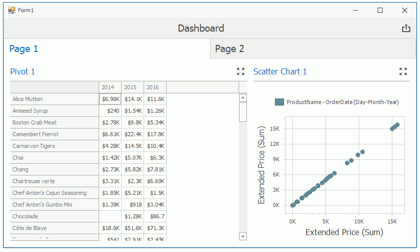

<!-- default badges list -->

<!-- default badges end -->

# Dashboard for WinForms - How to add window calculations for numeric measures in code

This example illustrates how to use API methods and properties to apply [window calculations](https://docs.devexpress.com/Dashboard/116917) to the values of the specified measure.

The application contains a [DashboardViewer](https://docs.devexpress.com/Dashboard/117122) control and performs the following tasks:

- creates an empty [tabbed dashboard](https://docs.devexpress.com/Dashboard/116693)
- loads a sample dashboard to the first tab page
- copies the dashboard items and layout to the second tab page
- applies window calculations to the values displayed in the [Pivot](https://docs.devexpress.com/Dashboard/15266) and [Scatter Chart](https://docs.devexpress.com/Dashboard/114805) dashboard items
- starts the timer to switch pages.

You can click the page to stop the timer and click again to restart.

The example screenshot is shown below:

## Files to Review

* [Form1.cs](./CS/WindowCalculationExample/Form1.cs)
* [TabPageLoadHelper.cs](./CS/WindowCalculationExample/TabPageLoadHelper.cs)

## Documentation

- [Dashboard](https://docs.devexpress.com/Dashboard/116503/basic-concepts-and-terminology/dashboard)
- [Dashboard Layout](https://docs.devexpress.com/Dashboard/116693/common-features/dashboard-layout)
- [Window Calculations](https://docs.devexpress.com/Dashboard/116917/common-features/advanced-analytics/window-calculations)

## More Examples

- [Dashboard for WinForms - How to display best and worst monthly sales for each year](https://github.com/DevExpress-Examples/how-to-display-best-and-worst-monthly-sales-for-each-year-t369371)
- [Dashboard for WinForms - How to Calculate the Contribution of Quarterly Sales to Total Yearly Sales](https://github.com/DevExpress-Examples/how-to-calculate-the-contribution-of-quarterly-sales-to-total-yearly-sales)
- [Dashboard for WinForms - How to evaluate a customer acquisition using the quarter/year of their first purchase](https://github.com/DevExpress-Examples/how-to-divide-customers-count-by-the-number-of-orders-they-made-t372356)
- [Dashboard for WinForms - How to divide customers' count by the number of orders they made](https://github.com/DevExpress-Examples/how-to-divide-customers-count-by-the-number-of-orders-they-made-t372356)
- [Dashboard for WinForms - How to calculate Highest Product Sales by Year](https://github.com/DevExpress-Examples/how-to-show-products-with-the-best-sales-in-a-year-along-with-sales-values-t372408)
- [Dashboard for WinForms - How to display sales by years in comparison with the previous year's sales](https://github.com/DevExpress-Examples/win-dashboard-display-previous-year-sales)
- [Dashboard for WinForms - How to Display Product Sales that are Greater than $20k](https://github.com/DevExpress-Examples/How-to-Display-Product-Sales-that-are-Greater-than-20k)
- [Dashboard for WinForms - How to Display Products with Sales Greater than Average Sales per Category](https://github.com/DevExpress-Examples/How-to-Display-Product-with-Sales-Greater-than-Average-Sales-per-Category)
- [Dashboard for WinForms - How to Use the W Function to Show Top N Products by Category](https://github.com/DevExpress-Examples/winforms-dashboard-w-function-example)
